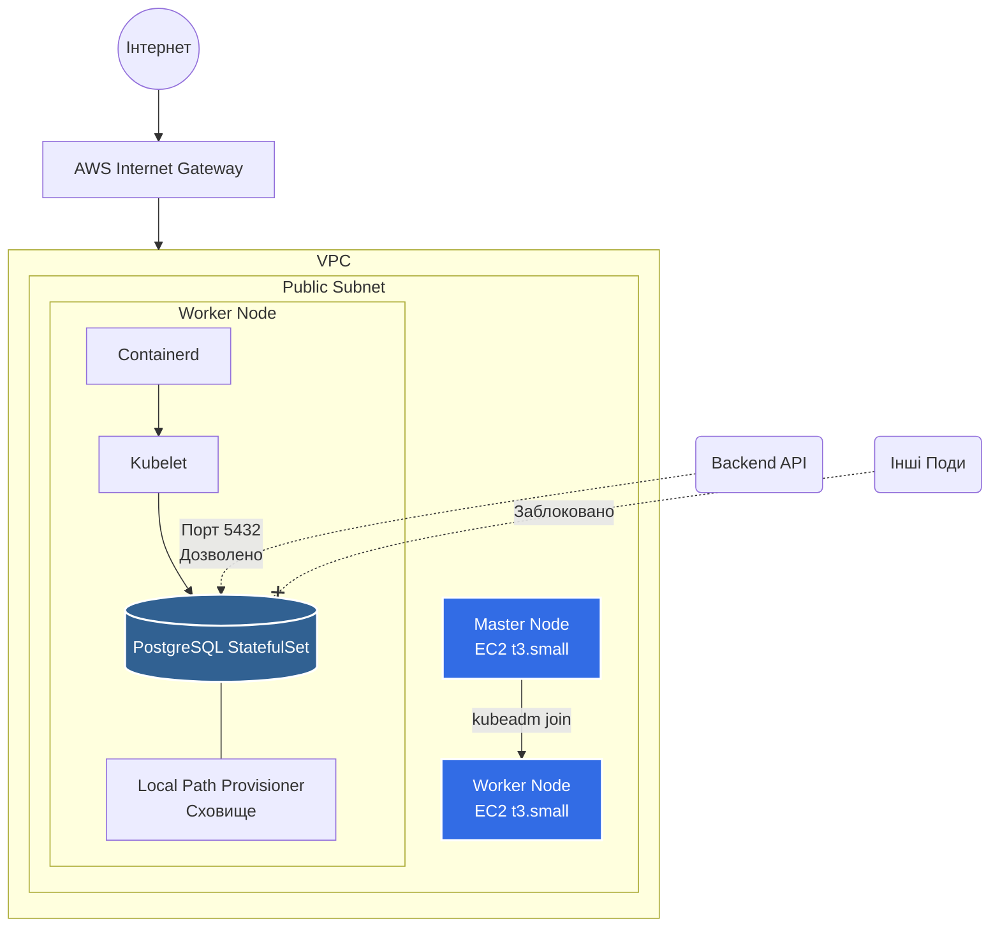

# 🏥 E-Health Bare Metal Kubernetes Інфраструктура


Цей репозиторій я створив для того щоб продемонструвати автоматизоване розгортання та налаштування "bare-metal" кластера Kubernetes з нуля за допомогою `kubeadm` на інстансах AWS EC2. Проєкт навмисно обходить керовані сервіси (такі як EKS), щоб продемонструвати глибоке розуміння внутрішніх процесів ОС Linux, container runtimes та кластерної мережі.

Проєкт адаптовано для **сфери охорони здоров'я (e-health)**, з акцентом на сувору ізоляцію мережі, безпечне зберігання даних та концепцію нульової довіри (Zero-Trust).

## 🏗 Архітектура 


## 1. Технічний стек
* **Infrastructure as Code (IaC):** Terraform (з кастомними модулями для бекапів у S3).
* Cloud Provider: AWS (VPC, EC2, SG, IGW).
* Cluster Bootstrap: kubeadm, Bash-скрипти (user_data для налаштування sysctl, swap, containerd).
* CNI (Networking): Calico (для підтримки строгих NetworkPolicies).
* Storage: Local Path Provisioner (імітація локальних дисків bare-metal для PV/PVC).
* Workload: PostgreSQL (StatefulSet).
* CI/CD & Quality: GitHub Actions, Pre-commit хуки (terraform fmt, tflint).

## 2. Структура репозиторію
```text

├── .github/workflows/         # CI/CD пайплайни (перевірка Terraform, збірка Docker)
├── apps/                      # Рівень аплікації (тестовий Backend)
│   ├── .docker/               # Dockerfiles для мікросервісів
│   └── .helm/                 # Helm-чарти для розгортання аплікації
├── infra/                     # Інфраструктура як код (Terraform)
│   ├── dev/                   # Конфігурації середовища (root-модуль)
│   │   └── scripts/           # Скрипти ініціалізації (master.sh, worker.sh)
│   └── modules/               # Перевикористовувані модулі Terraform (напр., s3-backup)
├── k8s/                       # Рівень K8s маніфестів
│   ├── local-cluster/         # Підготовлена структура для GitOps (FluxCD/ArgoCD)
│   └── postgres-tier/         # Розгортання БД (StatefulSet, Secrets, NetworkPolicy)
├── Makefile                   # Шорткати для стандартних операцій
└── .pre-commit-config.yaml    # Конфігурація pre-commit хуків
```
## 3. Безпека (в контексті Healthcare)
* Zero-Trust Networking: Реалізовано сувору NetworkPolicy K8s, яка дозволяє трафік до PostgreSQL тільки з подів із лейблом app: backend-api. Увесь інший внутрішній трафік кластера блокується.
* Ізоляція сховища (Storage Isolation): Дані записуються безпосередньо на ізольований дисковий простір Worker-ноди за допомогою local-path-provisioner, що мінімізує ризики, пов'язані з підключенням хмарних томів.
* Управління секретами: Паролі та користувачі абстраговані через Kubernetes Secrets (не захардкоджені в маніфестах розгортання).

## 4. Швидкий старт
### 1. Попередні вимоги
Переконайтеся, що локально встановлено наступні інструменти:
* aws-cli (налаштований з вашими IAM credentials)
* terraform (>= 1.5.0)
* kubectl
* AWS SSH Key Pair з назвою my-aws-key створений у вашому цільовому регіоні.
### 2. Розгортання інфраструктури
Створіть ресурси в AWS та автоматично ініціалізуйте кластер Kubernetes:
* make init
* make apply
(Зачекайте ~4 хвилини, поки інстанси EC2 запустяться, завантажать модулі ядра Linux, встановлять containerd та піднімуть Control Plane).
### 3. Деплой бази даних
Підключіться до Master-ноди по SSH (IP-адреса буде виведена в Terraform outputs) та застосуйте маніфести:
* kubectl apply -f k8s/postgres-tier/
Перевірте статус StatefulSet та Persistent Volume Claims:
* kubectl get pods,pvc -n ehealth
### 4. Очищення
Щоб уникнути непередбачуваних витрат в AWS, видаліть інфраструктуру після завершення роботи:
* make destroy

## 5. Як організовано репозиторій

| Шлях | Що лежить |
| :--- | :--- |
| `infra/` | **Terraform-код.** Папка `dev/` — готове оточення, `modules/` — перевикористовувані модулі (S3 Backup). |
| `k8s/` | **Kubernetes-маніфести.** Деплой бази даних (`postgres-tier`) та конфігурація локального кластера. |
| `apps/` | **Додатки.** Початковий Docker-код та Helm-чарти для розгортання бекенд-сервісів. |
| `Makefile` | **Головні команди.** Автоматизація `terraform init/apply`, форматування коду та швидкий деплой. |
| `.github/workflows/` | **CI/CD пайплайни.** Автоматична перевірка коду (linting) та тестова збірка Docker-образів. |

## 6. Технології та чому саме вони

| Компонент | Навіщо |
| :--- | :--- |
| **Terraform** | Описує та версіонує інфраструктуру в AWS як код (IaC). |
| **AWS (EC2/VPC)** | Хмарна база, що імітує "Bare Metal" залізо для кластера. |
| **kubeadm** | Стандартний інструмент для розгортання K8s з нуля (показує глибоке розуміння архітектури). |
| **containerd** | Сучасний і швидкий runtime для контейнерів, що відповідає стандартам CRI. |
| **Calico (CNI)** | Забезпечує мережеву зв'язність та підтримку Network Policies для безпеки БД. |
| **PostgreSQL** | Надійна база даних для збереження критичних медичних даних. |
| **Local Path Provisioner** | Динамічне управління локальними дисками вузлів для persistence-шару. |
| **GitHub Actions** | CI/CD пайплайни: автоматична перевірка коду та збірка Docker-образів. |
| **Makefile** | Зручні шорткати для швидкого керування проєктом: `make apply`, `make destroy`. |
| **Pre-commit hooks** | Гарантують якість коду: автоматичний `terraform fmt` та перевірка YAML. |

## 7. Як компоненти спілкуються між собою

1. **API Gateway / Backend:** Приймає HTTP-запити з медичними даними (транзакції, записи пацієнтів) та перенаправляє їх до внутрішніх сервісів у кластері.
2. **Data Tier (PostgreSQL):** Бекенд-сервіси записують дані у базу PostgreSQL. Завдяки `StatefulSet`, база має стабільне мережеве ім'я (`postgres-0.postgres.ehealth.svc.cluster.local`), що гарантує безперебійний зв'язок.
3. **Storage Persistence:** Кластер через `Local Path Provisioner` автоматично створює том (Volume) на диску фізичної ноди та монтує його в под з базою. Це забезпечує збереження даних навіть після перезавантаження поду.
4. **Network Security:** Весь трафік всередині кластера контролюється через **Calico**. Тільки авторизовані поди (наприклад, `backend-api`) можуть "бачити" порт 5432 бази даних. Всі інші спроби доступу автоматично блокуються на рівні ядра Linux.

**Секрети та безпека:** Конфіденційні дані (паролі БД, ключі доступу) не зберігаються у коді. Вони передаються в контейнери через **Kubernetes Secrets**, що дозволяє безпечно керувати доступами та відповідати стандартам захисту медичних даних.

## 8. Що було складно? 

* Автоматизація "голого заліза" через IaC: зазвичай Terraform використовується для підняття керованих сервісів (EKS), але я вирішив повністю підготувати ОС Linux до роботи в кластері, а саме налаштував модулі ядра, вимкнув swap та сконфігорував sysctl для мережевого мосту за допомогою написання Bash-скриптів, які виконуються при старті інстансів і гарантують ідентичність вузлів кластера.

* Проблема мережевої зв'язності (CNI): Після ініціалізації через kubeadm вузли мали статус NotReady. Я це вирішив впровадженням мережевого плагіна Calico. Це дозволило не тільки підняти мережу, але й реалізувати `NetworkPolicies` для безпеки бази даних, що критично для медичних проектів.

* Сховище даних (Storage) у динамічному середовищі: Нажаль kubeadm не має вбудованого StorageClass, при розгортанні PostgreSQL поди залишились в статусі Pending, система не розуміла де взяти дисковий простір, я це вирішив завдяки налаштуванням Local Path Provisioner, це дозволило кластеру динамічно виділити місце під бази даних безпосередньо на дисках ЕС2 вузлів.

## 9. Які знання я демонструю цим проєктом

| Тема | Де видно у проєкті |
| :--- | :--- |
| **Terraform & IaC Basics** | Файли `main.tf`, `variables.tf`, використання `data sources` та автоматизація через `user_data`. |
| **Modular Terraform** | Папка `modules/s3-backup` — створення перевикористовуваного модуля з налаштуванням безпеки бакета. |
| **K8s Cluster Bootstrapping** | Скрипт `infra/dev/scripts/master.sh` — ініціалізація кластера через `kubeadm` та налаштування `containerd`. |
| **Networking (CNI)** | Налаштування **Calico** для забезпечення зв'язку між подами та підтримки Network Policies. |
| **Persistence & Storage** | Конфігурація **Local Path Provisioner** у папці `k8s/local-cluster` для динамічного створення PVC. |
| **Workload Management** | Розгортання бази даних через **StatefulSet** у папці `k8s/postgres-tier` з налаштованим Service. |
| **CI/CD Pipelines** | Файли в `.github/workflows/` — автоматична збірка Docker та перевірка Terraform-коду. |
| **Secret Management** | Використання Kubernetes Secrets для зберігання паролів БД, що демонструє знання стандартів безпеки. |

